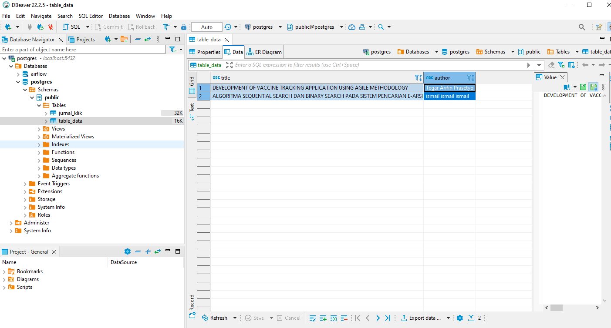
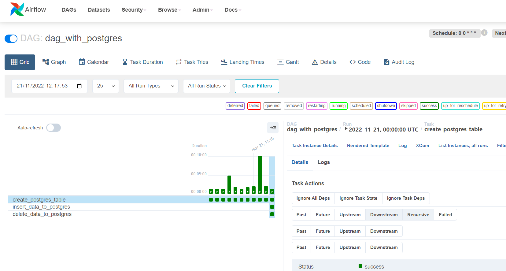

# running airflow with docker compose

this tutorial based on documentation in this link https://airflow.apache.org/docs/apache-airflow/stable/howto/docker-compose/index.html#running-airflow-in-docker

## Data in PostgresSQL

## Airflow UI
